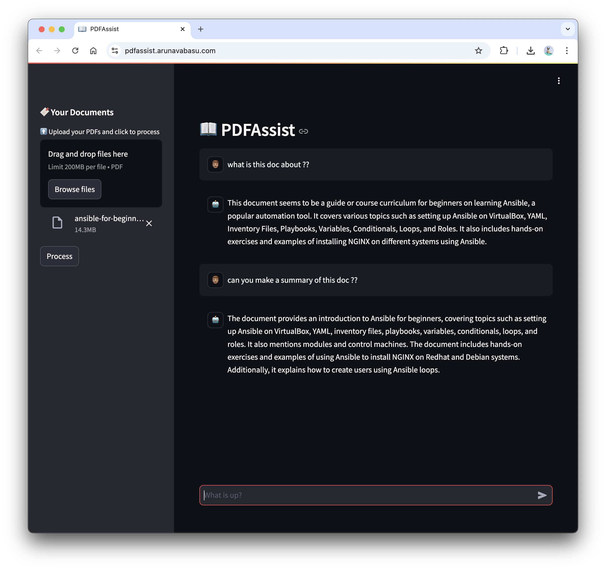

# 🔖 PDFAssist



PDFAssist let's you chat your pdf.It leverages the power of langchain  and streamlit to create a seamless and interactive PDF chat experience.It utilizes state-of-the-art LLMs including **gpt-3.5-turbo**, **LLama2-70b**, **LLama2-7b**,  **flan-t5-xxl** and many more (coming soon)to provide intelligent responses and meaningful interactions.

## Table of Contents
  - [Table of Contents](#table-of-contents)
  - [Features](#features)
  - [Installation](#installation)
  - [Contributing](#contributing)
  - [License](#license)

## Features

- **PDF Upload:** Easily upload a PDF document of your choice.
- **Chat Interface:** Engage in a chat conversation with the contents of the PDF.
- **Intelligent Responses:** The application uses advanced language models to provide contextually relevant responses.
- **Multimodal AI:** Combines the capabilities of GPT 3.5 Turbo, LLama2, and Flan 5XXL for a rich conversational experience.(Coming soon...)

## Installation

Follow these steps to set up the project locally:

1. **Clone the Repository:**

   ```bash
   git clone https://github.com/arunavabasu-03/PDFAssist.git
   cd PDFAssist
   ```

2. **Install Dependencies**

   ```bash
   pip install -r requirements.txt
   ```

3. **Run the Application:**

   ```bash
   python3 src/app.py
   ```


## Contributing

Contributions to this project are welcome!

## License

This project is licensed under the [MIT License](https://github.com/arunavabasu-03/PDFAssist/blob/main/LICENSE). Feel free to use, modify, and distribute the code for your own projects.
